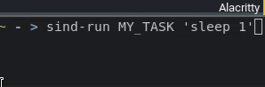
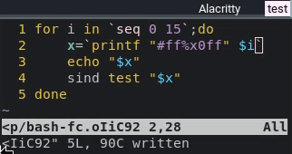

# simple-indicators
A minimalistic collection of bash scripts to visualize the state of tasks on the systray.

Described on this blog post: https://codigoparallevar.com/blog/2022/a-simple-status-indicator/

Compatible with Waybar and AwesomeWM: 

Built for responsiveness:

